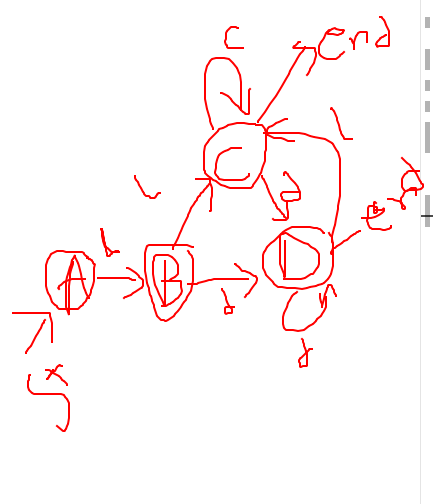
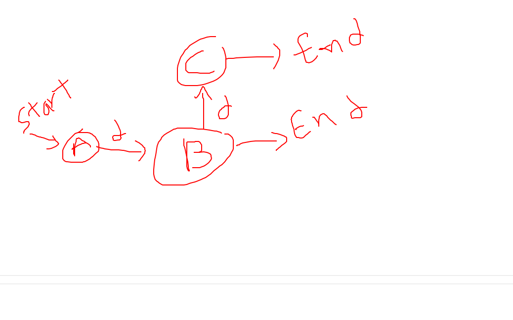

## RE=letter(letter|digit)\* 
### NFA:
 

set = {letter, digit}

e-close (0) = {0} A

move(A, l) = {1} 
e-close ({1}) = {1, 2, 3, 5, 8} -> B 
D-trans[A, l] = B 

move(A, d) = {}

move(B, l) = {4} 
e-close ({4}) = {2, 3, 4, 5, 7, 8} -> C 
D-Trans[B, l] = C 

move(B, d) = {6} 
e-close ({6}) = {2, 3, 5, 6, 7, 8} -> D 
D-trans[B, d] = D 

move(C, l) = {4} 
e-close ({4}) = C 
D-Trans[C, l] = C 

move(C, d) = {6} 
e-close ({6}) = D 
D-trans[C, d] = D 

move(D, l)={4} 
e-close ({4}) = C 
D-Trans[D, l] = C 

move(D, d) = {6} 
e-close ({6}) = D 
D-trans[D, d] = D 

state   | l | d
-----   | - | -
A       | B |
B       | C | D
C       | C | D
D       | C | D

### DFA
 

---
## RE=digit digit\*
### NFA:
 
Set = {digit}

e-close {0} = {0} -> A

move(A, d) = {1} 
e-close ({1}) = {1, 2, 4} -> B 
D-trans(A, d) = B 

move (B, d) = {3} 
e-close({3}) = {2, 4} -> C 
D-trans(B, d) = C 

move(C, d) = {3} 
e-close({3}) = C 
D-trans(C, d) = C 

state   | d
------- | -
A       | B
B       | C
C       | C
### DFA
 
