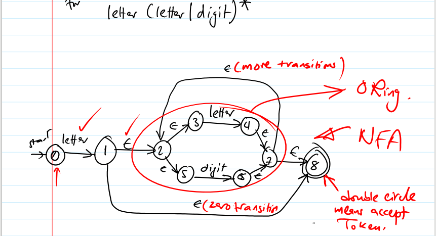
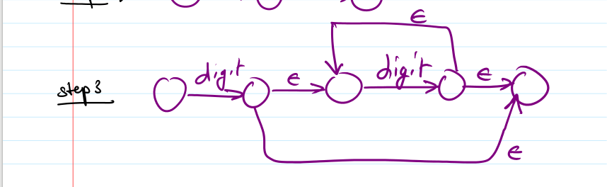

# Syllabus
1. Lexical analysis
2. Syntax analysis
    - Top-down parser
---
## 1. Lexical analysis
1. Identify Tokens, Lexemes, Patterns
2. Write regular expression
3. Write regular definition
4. Draw transition diagrams
5. Design Non-deterministic finite automation (NFA)
6. Transform Non-deterministic finite automation (NFA) to Deterministic finite automation (DFA)

### Example
1.  stmt  -> *if* R *then* stmt |
            *if* R *then* stmt *else* stmt | E 
    E     -> E + T | E - T | T 
    T     -> T * F | T / F | F 
    F     -> num | id | (E) 
    R     -> id relop id 
    relop -> > | < | >= | <= 
---
1. Solution 
    - **Step #1** Identify Tokens, Lexemes, Patterns
        Tokens      | Lexemes       | Patterns
        ----------- | ------------- | --------
        if          | if            | if
        then        | then          | then
        else        | else          | else
        add_op      | '+'           | '+' 
        sub_op      | '-'           | '-'
        mul_op      | '*'           | '*'
        dev_op      | '/'           | '/'
        left_brack  | '('           | '('
        right_brack | ')'           | ')'
        relop       | >, <, >=, <=  | >, <, >=, <= 
        id          | x1, pi,       | letter floowed by letters or digits
        num         | 3.14, 5.1     | digit or digits
    
    - **Step #2** Regular Expression 
        id: letter (letter | digit)\*  
        num: digit digit*
    - **Step #3** Regular definition
            stmt  -> *if* R *then* stmt |
            *if* R *then* stmt *else* stmt | E 
            E     -> E + T | E - T | T 
            T     -> T * F | T / F | F 
            F     -> num | id | (E) 
            R     -> id relop id 
            relop -> > | < | >= | <= 
        
        ---------------
        if -> if  
        then -> then 
        else -> else 
        num -> digit digit* 
        digit -> 0|1|2|3|4|5|6|7|8|9 
        id -> letter(letter | digit)* 
        letter -> a|b|...z|A|B|...|Z 
    - **Step #4** Transition Diagrams 
    start -> 
    0. 
        - i
            - 1. f
                - 2. return (if, if)
        - e
            - 3. l
                - 4. s
                    - 5. e
                        - 6. return(else, else)
        - t
            - 7. h
                - 8. e
                    - 9. n
                        - 10. return(then, then)
        - \+
            - 11. return (add_op, +)
        - \-
            - 12. return (sub_op, -)
        - \*
            - 13. return (mul_op, *)
        - \\
            - 14. return (div_op, \\)
        - \(
            - 19. return(left_brack, \( )
        - \)
            - 20. return(right_brack, \) )
        - \<
            - 15. \=
                - 16. return(relop, LE)
            - 17. other 
                - 18. return (relop LT)
        - \>
            - 21. \=
                - 22. return (relop, GE)
            - 23. other
                - 24. return (relop, GT)
    
    - **Step #5** Design Non-deterministic finite automation (NFA)
        - solution
            - 1. #### RE=letter(letter|digit)\*
                -  
            - 2. #### RE=digit digit\*
                -  
    - **Step #6** Transform Non-deterministic finite automation (NFA) to Deterministic finite automation (DFA)
        - [SOLUTION](./AMA/README.md)
    
---
## 2. Syntax analysis (**Top-down parser**)
1. Eliminate Ambigutiy
2. Eliminte Left recursion and left factoring
3. Draw transition diagram (*not necessary*)
4. Apply first/follow operators
5. Get parsing table
6. Parse statement

### Example
1.  E -> E + T | T 
    T -> T * F | F 
    F -> ( E ) | id 
design a non recursive non backtracking predictive parser. 
using your design parse the following statment `id + id * id` 

2.  S -> iEtS | iEtSeS | a  
    E -> b  
design a non recursive non backtracking predictive parser. 
using your design parse the following statment `ibtibtaea` 

---
2.  SOLUTION 
    - Step **1** Eliminate Ambigutiy (*don't do it in exam*)
    - Step **2** Eliminate Left Recursion and Left Factoring
        - There is no recursion
        - Factoring
            - S  -> iEtS*S'* | a 
            - S' -> eS | empty 
            - E  -> b 
    - Step **3** Draw transition diagram (*not necessary*)
    - Step **4** Apply First/Follow operators
        Non-terminal | First        | Follow
        ------------ | ------------ | ------
        S            | { i, a }        | { $, e }
        S'           | { e, empty } | { $, e }
        E            | { b }        | { t }
    - Step **5** Get parsing table
        Non-terminal | a      | b     | e                         | i             | t | $
        ------------ | ------ | ----- | ------------------------- | ------------- | - | ----------- 
        S            | S -> a |       |                           | S -> iEtS*S'* |   |  
        S'           |        |       |**S' -> eS S' -> empty**|               |   | S' -> empty
        E            |        | E-> b |                           |               |   |   
    - Step **6** Parse statement
        Stack           | Input           | Output
        --------------- | --------------- | ---------------
        $ S             | ibtibtaea$      |
        $ S'StEi        | ibtibtaea$      | S -> iEtS*S'*
        $ S'StE         | btibtaea$       |
        $ S'Stb         | btibtaea$       | E -> b
        $ S'St          | tibtaea$        |
        $ S'S           | ibtaea$         |
        $ S'S'StEi      | ibtaea$         | S -> iEtS*S'*
        $ S'S'StE       | btaea$          |
        $ S'S'Stb       | btaea$          | E -> b
        $ S'S'St        | taea$           | 
        $ S'S'S         | aea$            |
        $ S'S'a         | aea$            | S -> a
        $ S'S'          | ea$             |
        $ S'Se          | ea$             | S' -> eS
        $ S'S           | a$              | 
        $ S'a           | a$              | S -> a
        $ S'            | $               | 
        $               | $               | S' -> empty
        Stop Statement parsed
        - Is this grammar Left scan Left parse (**LL**)?
            - No, because 2 production in the same cell [S', e];  
            because grammar is ambiguous.
---
        
        
